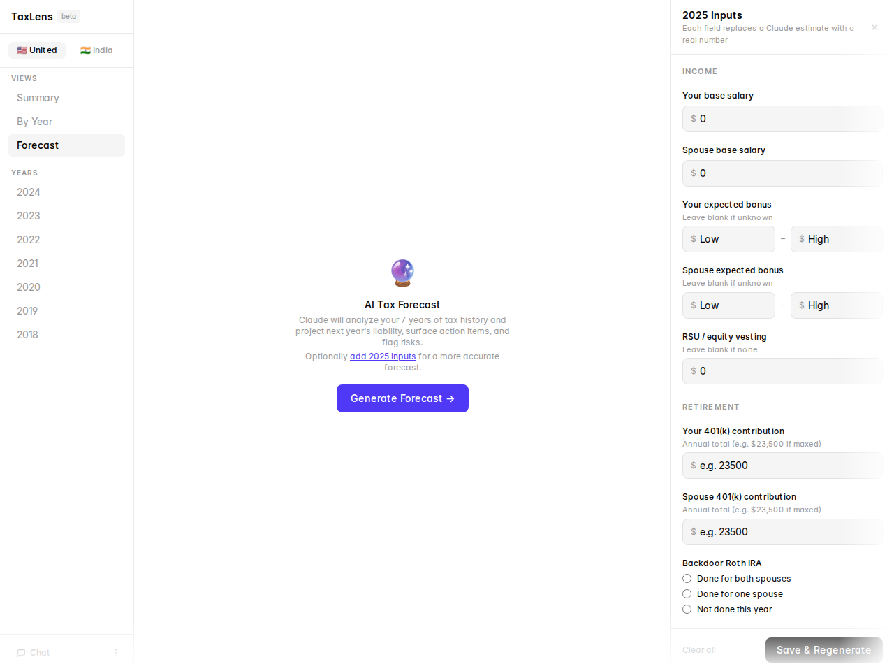

# TaxLens

Every year, you file your taxes and move on. Maybe you notice the refund or the amount owed. Then you put it away and don't think about it again.

But your tax returns are the most accurate financial record you have — verified income, actual tax paid, real deductions taken. Not estimates. Not projections. Ground truth, for every year you've filed. And almost nobody reads them.

The problem isn't that people don't care. It's timing. By the time you're filing, the year you're reporting on is already history. Every decision that could have changed that number — maximizing retirement contributions, harvesting losses, adjusting withholding, timing a bonus — had a deadline you already missed. So you file, forget, and repeat.

One return tells you little. Several years of returns tell you your actual effective rate trajectory, whether you've been systematically over-withholding, how your income mix has shifted, and which years you left real money on the table. These patterns are invisible until you look at them all at once — and they're exactly what a good tax advisor would walk you through, if most people could afford one.

TaxLens is that analysis, built from your actual data. Drop in your PDFs — US 1040s, India ITRs, or both. Claude parses them, reasons over your full history, and surfaces what you could have done differently and what to do before this year closes. Everything runs locally. No accounts, no cloud, no subscription.

Forked from [brianlovin/tax-ui](https://github.com/brianlovin/tax-ui).

---

## Features

- **Multi-country returns** — parse PDFs into structured data per country. Included out of the box: 🇺🇸 US (1040) and 🇮🇳 India (ITR-1 / ITR-2). Add any country via the plugin system — see [docs/ADDING_COUNTRY.md](docs/ADDING_COUNTRY.md).
- **Multi-year summary** — YoY charts, effective rate trend, income mix, refund history across all years
- **By Year view** — detailed breakdown per year with charts and receipt-style layout
- **Tax bracket visualizer** — color-coded stacked bar showing exactly where taxable income lands across each bracket, per-bracket income and tax, headroom to the next bracket (US)
- **What-if simulator** — sliders for 401(k) top-up, IRA, deductions, and capital gains; bracket bar updates live with a marker at your original position (US)
- **Retroactive insights** — per-year "what could you have done differently" analysis powered by Claude: bracket optimization, capital gains harvesting, deduction opportunities, country-specific regime comparisons
- **AI Forecast** — Claude reasons over your full tax history across all countries to project next year's liability, surface action items, and flag risks — no manual input
- **Verified tax constants** — bracket thresholds, deduction limits, and contribution caps hardcoded from authoritative sources and injected into every prompt so Claude uses exact figures rather than training-data estimates. Currently included: US (IRS) 2018–2026, India (Income Tax India) FY 2018–2025.
- **Chat with Claude** — year-aware conversation with your full tax history as context; ask what-ifs from any view
- **Country toggle** — switch between countries in the sidebar; appears automatically when you have data for more than one country

---

## Get Started

### 1. Install Bun

```bash
curl -fsSL https://bun.sh/install | bash
```

### 2. Clone and install

```bash
git clone https://github.com/harshitbshah/tax-ui
cd tax-ui
bun install
```

### 3. Run

```bash
bun run dev
```

Open [localhost:3005](http://localhost:3005). On first launch, the app will prompt you to enter your Anthropic API key — get one from [console.anthropic.com](https://console.anthropic.com/settings/keys). Alternatively, add it to a `.env` file before starting:

```
ANTHROPIC_API_KEY=sk-ant-...
```

---

## User Guide

### Importing returns

**US (1040):** Upload PDFs directly in the browser — drag-and-drop or the file picker. One PDF per tax year. The server parses it with Claude Sonnet and stores the result locally.

**Other countries (e.g. India ITR):** Each country plugin defines its own upload trigger. India returns can be uploaded via the sidebar menu, or via the CLI script for bulk import:

```bash
ANTHROPIC_API_KEY=sk-... bun run scripts/import-india.ts path/to/itr.pdf
```

Supports ITR-1 (Sahaj) and ITR-2, including the Java-serialized wrapper format from the Indian IT portal.

---

### Summary view

The default landing view. Shows:
- YoY effective rate trend
- Income mix chart (W-2, capital gains, RSUs, etc.)
- Refund/owed history
- All-years table with key metrics

If you have data for multiple countries, use the toggle at the top of the sidebar to switch between them.


---

### By Year view

Select any year from the sidebar. Toggle between **Receipt** (detailed line-item breakdown) and **Charts** tabs.


**Charts tab** shows three tools (US):

1. **Federal Tax Bracket Visualizer** — a color-coded stacked bar (green 10% → red 37%) showing exactly where taxable income lands. Each bracket shows income in the band and the tax it generated. The marginal bracket is highlighted with a "you are here" label; headroom to the next bracket is shown in gray. If the bracket-computed tax differs from the filed amount by >$500, a note explains why (AMT, QBI deduction, etc.).

   

2. **What-if Simulator** — four sliders let you adjust:
   - 401(k) top-up (0 to year's employee limit)
   - IRA contribution (0 to year's limit)
   - Additional deductions (0 to $50K)
   - Capital gain/loss adjustment (−$50K to +$50K; negative = harvest losses)

   The bracket bar updates live as you move sliders — a white marker line shows where your original income was. The simulator shows before→after taxable income and bracket tax, with a green savings callout. Resets automatically when you navigate to a different year.

   

3. **Income breakdown** and **waterfall charts**.

**Retroactive Insights** appear below the receipt on the Receipt tab. Click **Generate →** to ask Claude what you could have done differently to reduce your tax bill for that year. Results are cached; click **⟳ Regenerate** to refresh.

A badge shows whether verified constants are on file for that year (green ✓) or whether Claude is estimating from training data (amber ⚠).


---

### Forecast view

Click **Forecast** in the sidebar. Click **Generate Forecast →** to have Claude analyze your full tax history across all countries and produce a structured projection for next year:

- **Projected tax liability** — with low/high range
- **Effective rate** — projected with range
- **Estimated outcome** — likely refund or owed at filing
- **Bracket position** — where your projected income lands, with headroom to the next bracket (US)
- **AI assumptions** — what Claude inferred (salary growth, capital gains variance, deduction patterns) with confidence levels
- **Action items** — forward-looking optimizations and lessons carried from past years
- **Risk flags** — genuine uncertainties that could shift the projection
- **Country-specific sections** — e.g. India old vs. new regime recommendation when India returns are present

Generation runs in the background — you can navigate to other views while Claude works and return to see the result. Click **⟳ Regenerate** to refresh. Results are cached across page loads and server restarts.


#### 2025 Inputs panel

Click **+ Add inputs** (or **Edit inputs**) in the confidence banner to open the inputs panel. Fill in what you know — salary, bonuses, RSUs, 401(k) contributions, YTD withholding, capital events. Each field you fill replaces a Claude assumption with a real number, improving the accuracy of the projected outcome and reducing the chance of incorrect action items (e.g. "maximize your 401k" when you already have).

The banner shows how many of the 7 input groups are filled and a confidence label (Low → High).



---

### Chat

Click the chat icon in the sidebar footer to open the chat panel. Claude has access to your full tax history across all countries and knows which year you're currently viewing. Use it for what-if questions:

- "What if I sell my NVDA shares this year?"
- "What if I don't get a bonus?"
- "Why did my effective rate jump in 2022?"
- "How much more would I owe if I exercised my options?"

Follow-up suggestions appear after each response.

---

### Tax constants — what the badges mean

TaxLens hardcodes tax constants from authoritative government sources and injects them into every forecast and insights prompt so Claude uses verified figures rather than training-data recall.

Currently included:

- **US (IRS):** bracket thresholds, standard deductions, LTCG rates, and 401(k)/IRA contribution limits for **2018–2026** (2025 reflects OBBBA amendments; 2026 LTCG pending)
- **India (Income Tax India):** old and new regime slabs, standard deduction, 87A rebate, surcharge thresholds, 4% cess, and 80C/80D/80CCD deduction caps for **FY 2018–2025**

Badge meanings:
- **Green ✓** — verified constants on file; Claude will use exact figures
- **Amber ⚠** — no constants on file for this year; Claude will estimate from training data and flag uncertainty

To update constants for a new tax year or add constants for a new country, see [`docs/ADDING_COUNTRY_CONSTANTS.md`](docs/ADDING_COUNTRY_CONSTANTS.md).

---

## Development

```bash
bun run dev          # dev server with HMR on localhost:3005
bun test             # unit tests
bunx tsc --noEmit    # type check
bun run lint         # ESLint + Prettier
```

### Docs

- [`docs/ARCHITECTURE.md`](docs/ARCHITECTURE.md) — full system architecture, data flow, component map, model usage, key design decisions
- [`docs/ADDING_COUNTRY.md`](docs/ADDING_COUNTRY.md) — step-by-step guide to onboarding a new country (schema, parser, server plugin, client plugin, registration)
- [`docs/ADDING_COUNTRY_CONSTANTS.md`](docs/ADDING_COUNTRY_CONSTANTS.md) — how to add verified tax constants for a new country or tax year
- [`docs/FEATURES.md`](docs/FEATURES.md) — full feature backlog
- [`docs/FORECAST_SPEC.md`](docs/FORECAST_SPEC.md) — AI forecast + insights feature spec

---

## Privacy & Security

All data stays local. Tax return PDFs are sent to Anthropic's API (your key) for parsing and then stored on your machine. Nothing goes to any other server.

- All return data files (`.tax-returns.json`, `.<country>-tax-returns.json`) are gitignored — never committed
- API key stays in `.env` — never committed
- No analytics, no telemetry, no cloud storage

Anthropic's commercial terms prohibit training models on API customer data. See [Anthropic's Privacy Policy](https://www.anthropic.com/legal/privacy).

<details>
<summary>Security audit prompt</summary>

```
I want you to perform a security and privacy audit of TaxLens, an open source tax return parser.

Repository: https://github.com/harshitbshah/tax-ui

Please analyze the source code and verify:

1. DATA HANDLING
   - Tax return PDFs are sent directly to Anthropic's API for parsing
   - No data is sent to any other third-party servers
   - Parsed data is stored locally only

2. NETWORK ACTIVITY
   - Identify all network requests in the codebase
   - Verify the only external calls are to Anthropic's API
   - Check for any hidden data collection or tracking

3. API KEY SECURITY
   - Verify API keys are stored locally and not transmitted elsewhere
   - Check that keys are not logged or exposed

Key files to review:
- src/index.ts (Bun server and API routes)
- src/lib/parser.ts (US return parsing)
- src/lib/india-parser.ts (India ITR parsing)
- src/lib/country-storage.ts (generic local storage for all countries)
- src/lib/pdf-utils.ts (PDF unwrapping)
- src/App.tsx (React frontend)
```

</details>

---

## Requirements

- [Bun](https://bun.sh) v1.0+
- Anthropic API key
- Your own tax return PDFs
