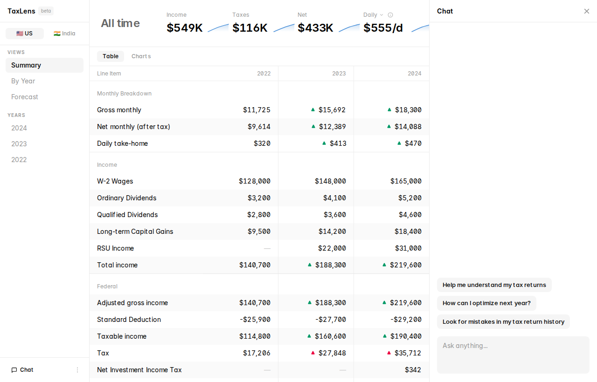
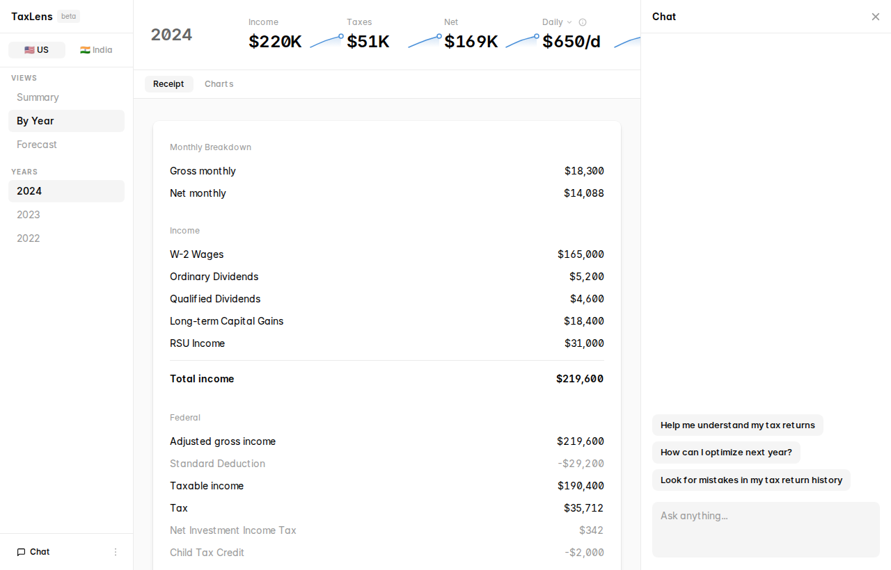
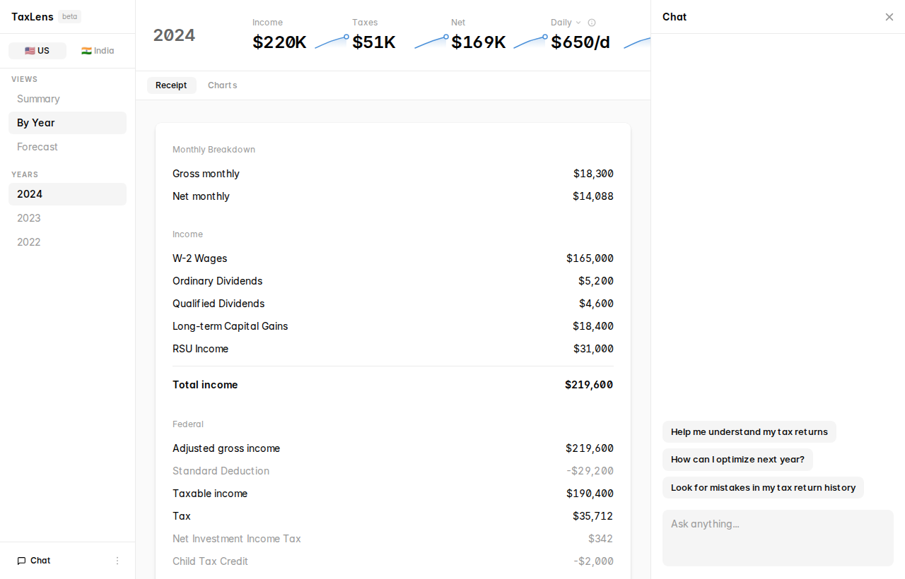
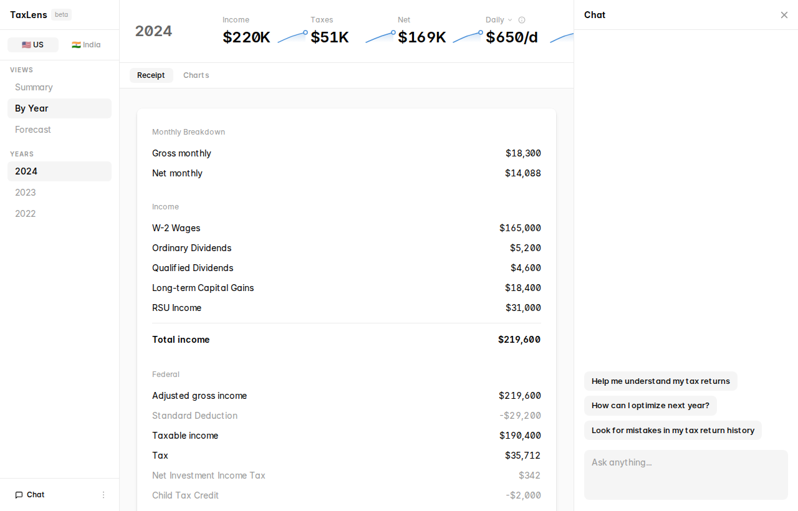
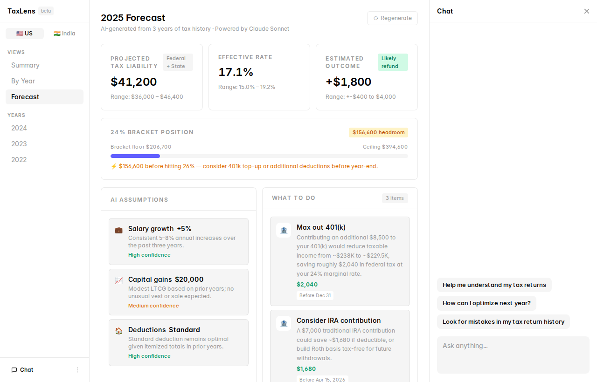
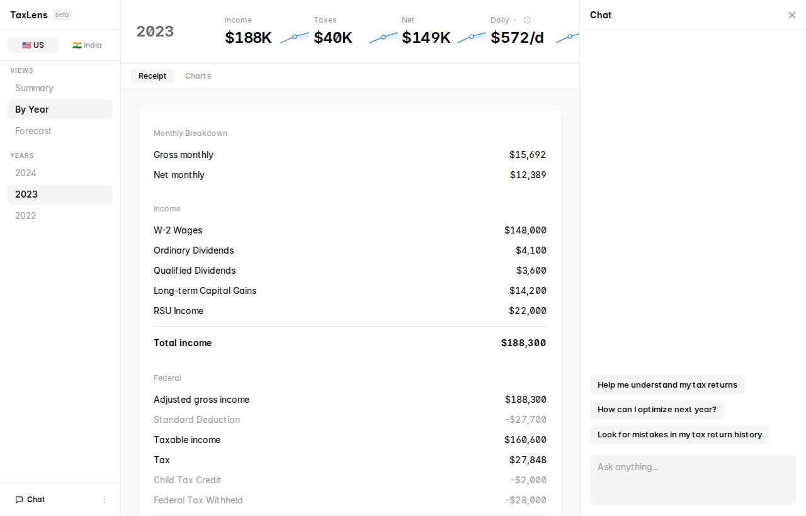

# TaxLens

Visualize, understand, and plan your taxes. Parse US (1040) and India (ITR) returns from PDF, explore multi-year trends, get AI-powered retroactive insights per year, and generate a forward forecast — all with your tax history as context.

Forked from [brianlovin/tax-ui](https://github.com/brianlovin/tax-ui).

---

## Screenshots













---

## Features

- **US returns (1040)** — parse PDFs into structured data: income, deductions, brackets, refund/owed, effective rate
- **India returns (ITR-1 / ITR-2)** — import from Indian IT portal PDFs including Java-serialized wrappers; capital gains, TDS, advance tax, YoY trends
- **Multi-year summary** — YoY charts, effective rate trend, income mix, refund history across all years
- **By Year view** — detailed breakdown per year with charts and receipt-style layout
- **Tax bracket visualizer** — color-coded stacked bar showing exactly where taxable income lands across each bracket, per-bracket income and tax, headroom to the next bracket
- **What-if simulator** — sliders for 401(k) top-up, IRA, deductions, and capital gains; bracket bar updates live with a marker at your original position
- **Retroactive insights** — per-year "what could you have done differently" analysis: bracket optimization, capital gains harvesting, deduction opportunities, India regime comparison
- **AI Forecast** — Claude reasons over your full tax history to project next year's liability, surface action items, bracket position, and risk flags — no manual input
- **Verified tax constants** — IRS bracket thresholds, standard deductions, LTCG rates, and contribution limits for 2018–2026; India tax slabs (old/new regimes), surcharge, cess, and deduction caps for FY 2018–2025 — hardcoded from authoritative sources and injected into every prompt
- **Chat with Claude** — year-aware conversation with your full tax history as context; ask what-ifs from any view
- **Country toggle** — switch between 🇺🇸 US and 🇮🇳 India views

---

## Get Started

### 1. Install Bun

```bash
curl -fsSL https://bun.sh/install | bash
```

### 2. Get an Anthropic API Key

Get a key from [console.anthropic.com](https://console.anthropic.com/settings/keys). Add it to `.env`:

```
ANTHROPIC_API_KEY=sk-ant-...
```

### 3. Run

```bash
git clone https://github.com/harshitbshah/tax-ui
cd tax-ui
bun install
bun run dev
```

Open [localhost:3005](http://localhost:3005).

---

## User Guide

### Importing returns

**US (1040):** Upload PDFs directly in the browser — drag-and-drop or the file picker. One PDF per tax year. The server parses it with Claude Sonnet and stores the result locally.

**India (ITR):** Use the CLI script:

```bash
ANTHROPIC_API_KEY=sk-... bun run scripts/import-india.ts path/to/itr.pdf
```

Supports ITR-1 (Sahaj) and ITR-2. Handles PDFs from the Indian IT portal, including the Java-serialized wrapper format.

---

### Summary view

The default landing view. Shows:
- YoY effective rate trend
- Income mix chart (W-2, capital gains, RSUs, etc.)
- Refund/owed history
- All-years table with key metrics

Switch between US and India with the toggle at the top of the sidebar.

---

### By Year view

Select any year from the sidebar. Toggle between **Receipt** (detailed line-item breakdown) and **Charts** tabs.

**Charts tab** shows three tools:

1. **Federal Tax Bracket Visualizer** — a color-coded stacked bar (green 10% → red 37%) showing exactly where taxable income lands. Each bracket shows income in the band and the tax it generated. The marginal bracket is highlighted with a "you are here" label; headroom to the next bracket is shown in gray. If the bracket-computed tax differs from the filed amount by >$500, a note explains why (AMT, QBI deduction, etc.).

2. **What-if Simulator** — four sliders let you adjust:
   - 401(k) top-up (0 to year's employee limit)
   - IRA contribution (0 to year's limit)
   - Additional deductions (0 to $50K)
   - Capital gain/loss adjustment (−$50K to +$50K; negative = harvest losses)

   The bracket bar updates live as you move sliders — a white marker line shows where your original income was. The simulator shows before→after taxable income and bracket tax, with a green savings callout. Resets automatically when you navigate to a different year.

3. **Income breakdown** and **waterfall charts** (existing).

**Retroactive Insights** appear below the receipt on the Receipt tab. Click **Generate →** to ask Claude what you could have done differently to reduce your tax bill for that year — bracket optimization, capital gains harvesting, deduction opportunities, India old vs. new regime comparison. Results are cached; click **⟳ Regenerate** to refresh.

A badge shows whether verified constants are on file for that year (green ✓ US + India) or whether Claude is using its training data (amber ⚠).

---

### Forecast view

Click **Forecast** in the sidebar Views section. Click **Generate Forecast →** to have Claude analyze your full tax history and produce a structured projection for next year:

- **Projected tax liability** — federal + state, with low/high range
- **Effective rate** — projected with range
- **Estimated outcome** — likely refund or owed at filing
- **Bracket position** — where your projected income lands, with headroom to the next bracket
- **AI assumptions** — what Claude inferred (salary growth, capital gains variance, deduction patterns) with confidence levels
- **Action items** — forward-looking optimizations and lessons carried from past years
- **Risk flags** — genuine uncertainties that could shift the projection
- **India regime comparison** — if India returns are present, old vs. new regime recommendation for the upcoming year

Generation runs in the background — you can navigate to other views while Claude works and return to see the result. Click **⟳ Regenerate** to refresh. Results are cached across page loads and server restarts.

The header shows amber ⚠ badges only for years where IRS constants are not on file (nothing shown when all years are verified).

---

### Chat

Click the chat icon in the sidebar footer to open the chat panel. Claude has access to your full tax history and knows which year you're currently viewing. Use it for what-if questions:

- "What if I sell my NVDA shares this year?"
- "What if I don't get a bonus?"
- "Why did my effective rate jump in 2022?"
- "How much more would I owe if I exercised my options?"

Follow-up suggestions appear after each response.

---

### Tax constants — what the badges mean

TaxLens hardcodes tax constants from authoritative government sources and injects them into every forecast and insights prompt so Claude uses verified figures rather than training-data recall.

**US (IRS):** bracket thresholds, standard deductions, LTCG rates, and 401(k)/IRA contribution limits for **2018–2026** (2025 reflects OBBBA amendments; 2026 LTCG pending).

**India (Income Tax India):** old and new regime slabs, standard deduction, 87A rebate, surcharge thresholds, 4% cess, and 80C/80D/80CCD deduction caps for **FY 2018–2025**.

Badge meanings:
- **Green ✓** — verified constants on file; Claude will use exact figures
- **Amber ⚠** — no constants on file for this year; Claude will estimate from training data and flag uncertainty

To update constants for a new tax year or add a new country, see `docs/ADDING_COUNTRY_CONSTANTS.md`.

---

## Development

```bash
bun run dev          # dev server with HMR on localhost:3005
bun test             # unit tests
bunx tsc --noEmit    # type check
bun run lint         # ESLint + Prettier
```

See [`docs/ARCHITECTURE.md`](docs/ARCHITECTURE.md) for a full architecture walkthrough.

---

## Privacy & Security

All data stays local. Tax return PDFs are sent to Anthropic's API (your key) for parsing and then stored on your machine. Nothing goes to any other server.

- `.tax-returns.json` and `.india-tax-returns.json` are gitignored — never committed
- API key stays in `.env` — never committed
- No analytics, no telemetry, no cloud storage

Anthropic's commercial terms prohibit training models on API customer data. See [Anthropic's Privacy Policy](https://www.anthropic.com/legal/privacy).

<details>
<summary>Security audit prompt</summary>

```
I want you to perform a security and privacy audit of TaxLens, an open source tax return parser.

Repository: https://github.com/harshitbshah/tax-ui

Please analyze the source code and verify:

1. DATA HANDLING
   - Tax return PDFs are sent directly to Anthropic's API for parsing
   - No data is sent to any other third-party servers
   - Parsed data is stored locally only

2. NETWORK ACTIVITY
   - Identify all network requests in the codebase
   - Verify the only external calls are to Anthropic's API
   - Check for any hidden data collection or tracking

3. API KEY SECURITY
   - Verify API keys are stored locally and not transmitted elsewhere
   - Check that keys are not logged or exposed

Key files to review:
- src/index.ts (Bun server and API routes)
- src/lib/parser.ts (US return parsing)
- src/lib/india-parser.ts (India ITR parsing)
- src/lib/storage.ts (local storage — US)
- src/lib/india-storage.ts (local storage — India)
- src/lib/pdf-utils.ts (PDF unwrapping)
- src/App.tsx (React frontend)
```

</details>

---

## Requirements

- [Bun](https://bun.sh) v1.0+
- Anthropic API key
- Your own tax return PDFs
